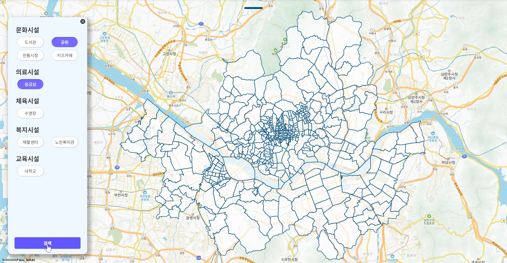
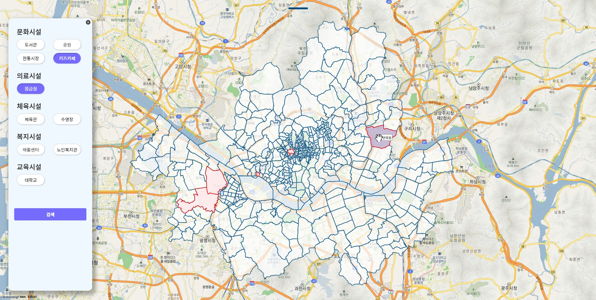
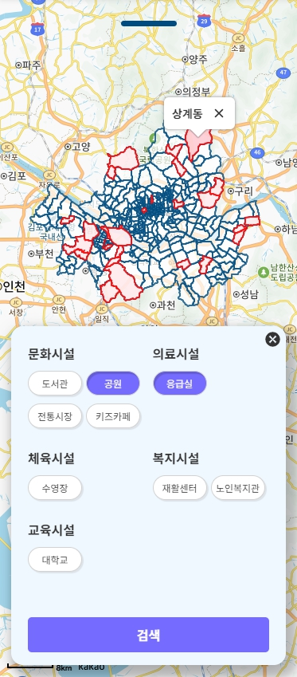
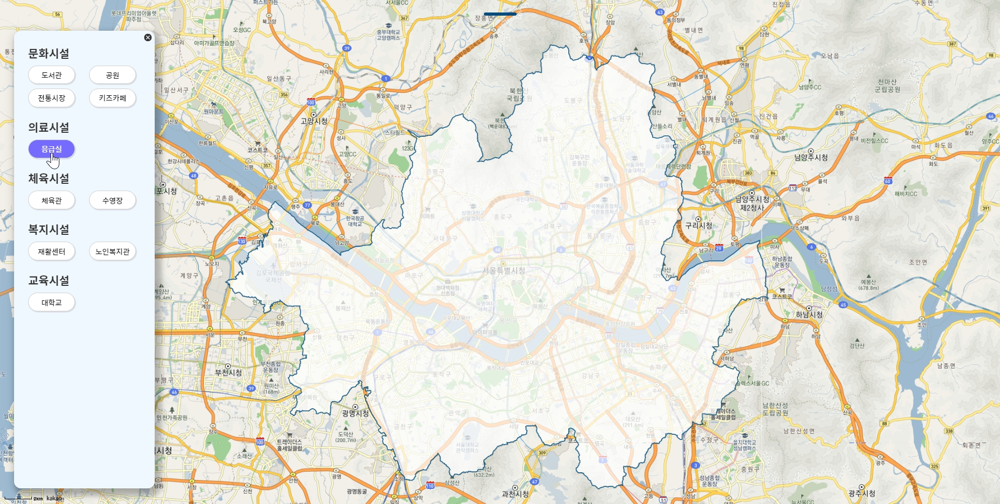
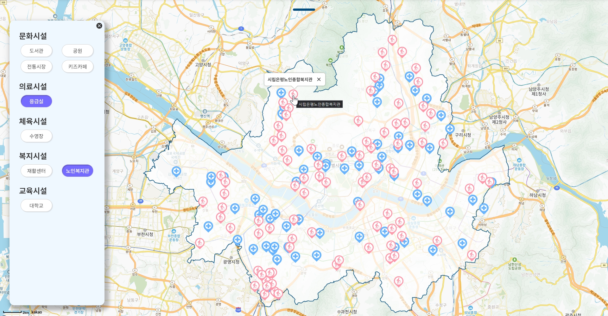
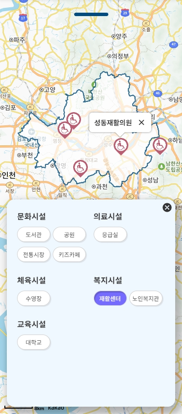
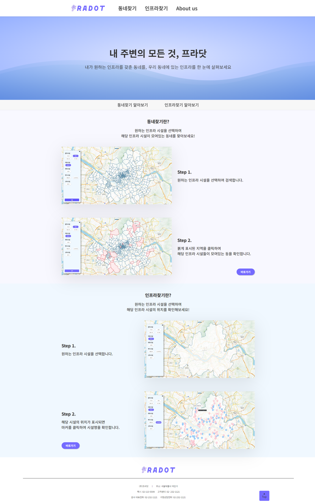
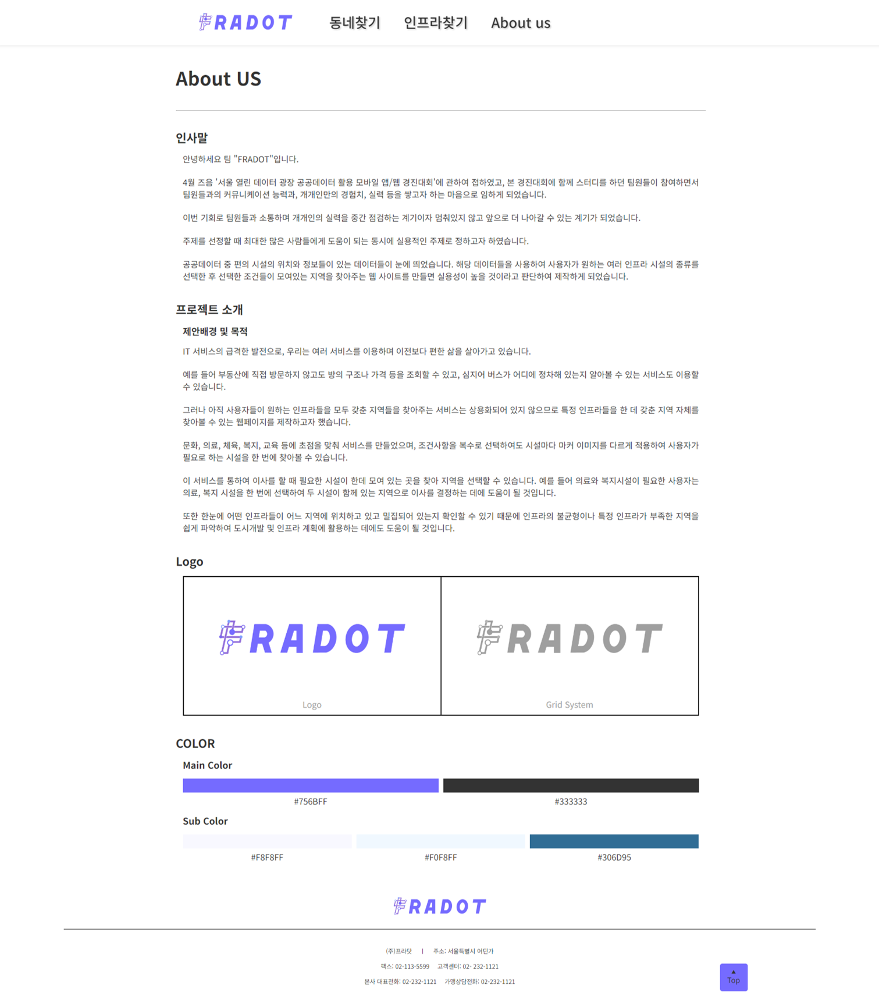
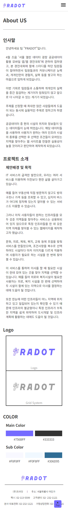

# FRADOT
<br />
<div align="center">
  
</div>

<div align="center">
  <h4>내 주변의 모든 것, 프라닷 ( http://fradot.store/ )</h4>
</div>

## 📁 프로젝트 소개
FRADOT 서비스는 서울시 공공데이터를 사용하여 만든 웹사이트로, 사용자에게 다음의 기능을 제공한다.
1. 서울시 내에 사용자가 원하는 인프라를 갖춘 동네를 찾아준다.
2. 서울시 내에 사용자가 원하는 인프라의 위치 및 이름을 알려준다.

위의 기능들을 사용하여 사용자는 주거지를 선택할 때 손쉽게 원하는 시설들을 갖춘 동네를 찾을 수 있다.  
또한 시설들의 위치를 한눈에 볼 수 있어 도시개발, 인프라 시설 추가 계획에 도움이 될 수 있다.<br>

#### 1차 진행
- [FRADOT 1차 깃허브 이동](https://github.com/Frot-Team1/FRADOT)

#### 2차 진행
- 반응형 추가 구현

## ⏱ 개발 기간
- 1차 : 23.03.31 ~ 23.05.30
- 2차 : 23.07.27 ~ 23.08.31

## 🧑 팀원 소개 ‍ 
- 팀원 : 김재하
- 팀원 : 김규홍
- 팀원 : 최지원

## 📃시작 가이드
### 다운로드 파일
- node js : https://nodejs.org/ko/download
- yarn : https://yarn.softonic.kr
### terminal
```
$ git clone https://github.com/porject1/FRADOT_RE.git
$ cd FRADOT_RE
$ yarn install
$ yarn dev
```

## 💻 기능 및 화면 소개
### 동네찾기 페이지
- 선택된 인프라 시설이 모두 위치하는 지역 붉게 표시
- 해당 지역을 클릭하면 동 이름 표시

  - #### 웹
    <div>
      
    </div>
    <div>
      
    </div>
  
  - #### 모바일
    <div>
      
    </div>

### 인프라찾기 페이지
- 선택된 인프라 시설의 위치를 마커로 표시
- 해당 마커를 클릭하면 인프라 시설 이름 표시

  - #### 웹
    <div>
      
    </div>
    <div>
      
    </div>
    
  - #### 모바일
    <div>
      
    </div>

### 메인 페이지
- #### 웹
  <div>
    
  </div>
  
- #### 모바일
  <div>
    
  </div>

### 어바웃어스 페이지
- #### 웹
  <div>
    
  </div>

- #### 모바일
  <div>
    
  </div>

## ⚙ Stacks
### Environment
<div>
  
  
  
  
</div>

### Development
<div>
  
  
  
  
  
</div>

### API
<div>
  
  
</div>
